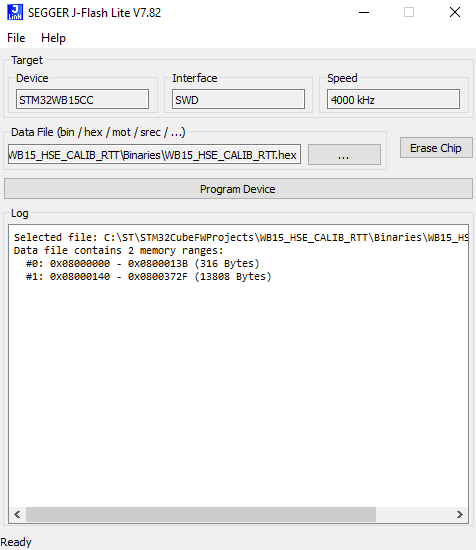
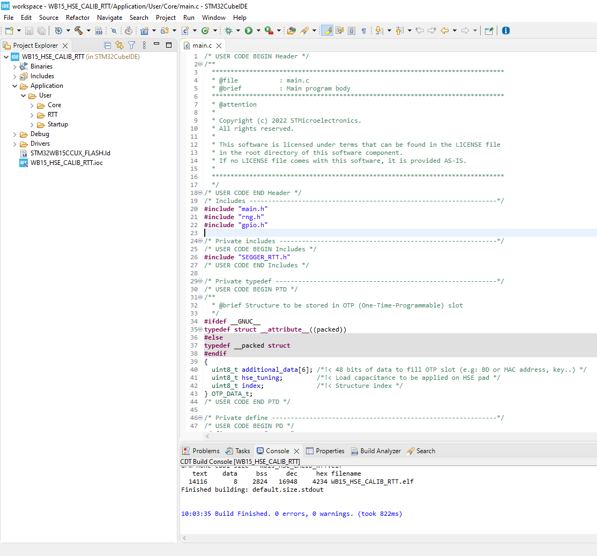
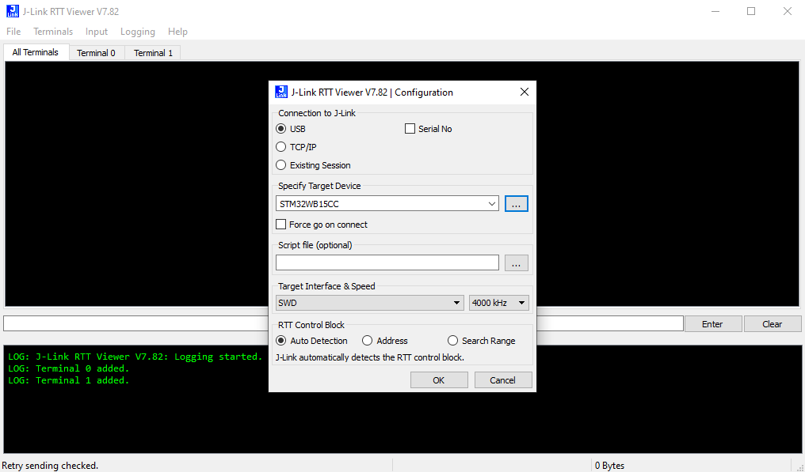
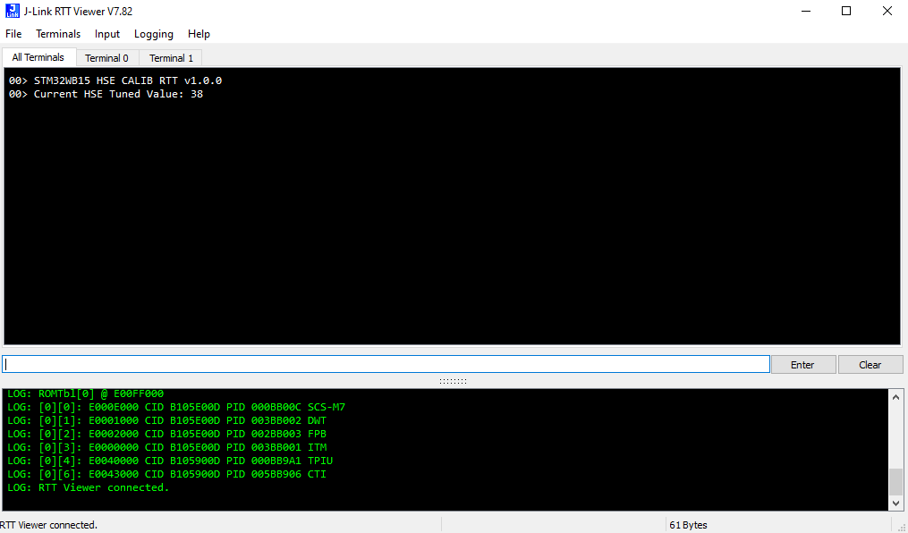
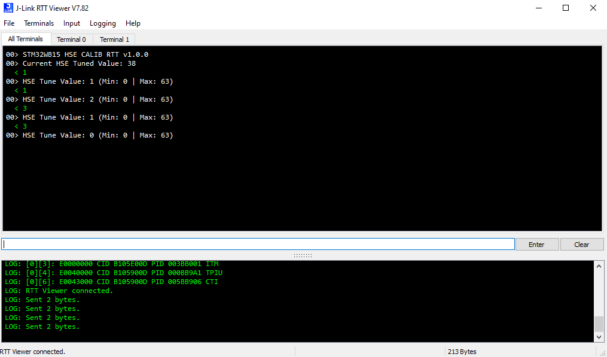
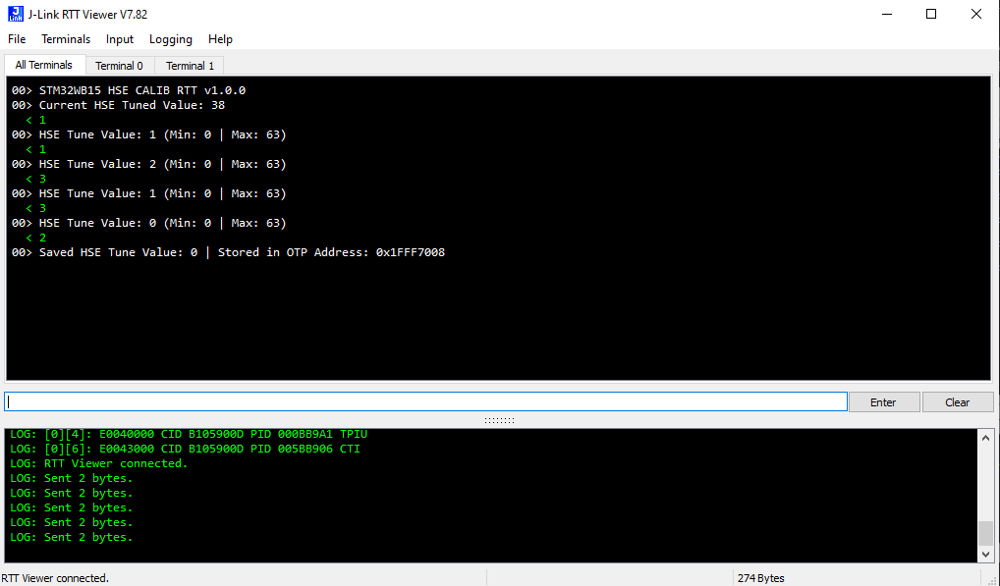

# STM32WB15-HSE-CALIB-J-LINK-RTT

* The STM32WB15-HSE-CALIB-J-LINK-RTT is an application example based on the RCC_HSE_Calib application found in the [X-CUBE-CLKTRIM](https://www.st.com/en/embedded-software/x-cube-clktrim.html) expansion package.
* This example allows the user to tune the HSE by adjusting 2 internal capacitors via [SEGGER J-Link RTT](https://wiki.segger.com/RTT).
* The application replaces the button functionality of the RCC_HSE_Calib application with J-Link RTT.
* This example is stored in Flash memory while the RCC_HSE_Calib application is stored temporarily in SRAM1.
  * Flash: 0x0800 0000
  * SRAM1: 0x2000 0000
* Please note that the MCO Pin will not output the clock in Low Power Mode. For more details check [DS13258](https://www.st.com/resource/en/datasheet/stm32wb15cc.pdf) section 3.10.
* For more information about the X-CUBE-CLKTRIM package, check [AN5042](https://www.st.com/resource/en/application_note/an5042-precise-hse-frequency-and-startup-time-tuning-for-stm32-wireless-mcus-stmicroelectronics.pdf).

## Hardware Needed

  * One [NUCLEO-WB15CC](https://www.st.com/en/evaluation-tools/nucleo-wb15cc.html)

  * One SEGGER [J-Link / J-Trace Debug Probe](https://www.segger.com/products/debug-trace-probes/)

## Software Needed

  * Prebuilt firmware image: WB15_HSE_CALIB_RTT.hex (STM32WB15-HSE-CALIB-J-LINK-RTT\Binaries)

  * [J-Link Software Pack](https://www.segger.com/downloads/jlink/)

## User's Guide

1) Connect a J-Link / J-Trace debug probe to the NUCLEO-WB15CC. 

    a) Follow this [article](https://community.st.com/s/article/how-to-connect-a-j-link-debug-probe-to-the-nucleo-wb55rg) for instructions on how to connect it. The article is written for the NUCLEO-WB55, but the steps are similar.

2) Flash the application firmware on to the nucleo board using one of the 2 options below:

    a) Use [J-Flash LITE](https://www.segger.com/products/debug-probes/j-link/technology/flash-download/#:~:text=statistics%20upon%20success.-,J%2DFlash%20LITE,-J%2DFlash%20Lite) included with the [J-Link Software Pack](https://www.segger.com/downloads/jlink/) to download the hex file on to the Nucleo board.

    

    b) Open your preferred IDE (Keil MDK-ARM, IAR EWARM, or STM32CubeIDE) and build & run the project to download it on to the Nucleo board.

    

3) Open RTT Viewer from the [J-Link Software Pack](https://www.segger.com/downloads/jlink/) and connect to the Nucleo board.

4) Once the application example has started, you will see an initial message and the current HSE Tuned Value.

    > Note: You may need to press the SW4 reset button to start the application example.

5) Type '1' or '3' in the RTT Viewer input to increase or decrease the new HSE Tune Value (starting from 0).

6) Type '2' in the RTT Viewer input to save the HSE Tune Value 

  > Note: The HSE Tune Value is saved in the OTP (One Time Programmable) data section. This section is limited to 1 kB of size (0x1FFF 7000 - 0x1FFF 73FF). You are responible for checking if the OTP has space left. Check [RM0434](https://www.st.com/resource/en/reference_manual/rm0434-multiprotocol-wireless-32bit-mcu-armbased-cortexm4-with-fpu-bluetooth-lowenergy-and-802154-radio-solution-stmicroelectronics.pdf) for more information.

## Troubleshooting

**Caution** : Issues and the pull-requests are **not supported** to submit problems or suggestions related to the software delivered in this repository. The STM32WB15-HSE-CALIB-J-LINK-RTT example is being delivered as-is, and not necessarily supported by ST.

**For any other question** related to the product, the hardware performance or characteristics, the tools, the environment, you can submit it to the **ST Community** on the STM32 MCUs related [page](https://community.st.com/s/topic/0TO0X000000BSqSWAW/stm32-mcus).